## 1. Big Data Analysis Overview

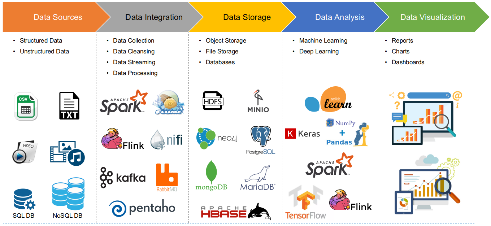

## 2. Batch Processing vs Stream Processing
### 2.1. Batch Processing
In batch processing, newly arriving data elements are collected into a group. The whole group is then processed at a future time (as a batch, hence the term “batch processing”). Exactly when each group is processed can be determined in a number of ways–for example, it can be based on a scheduled time interval (e.g. every five minutes, process whatever new data has been collected) or on some triggered condition (e.g. process the group as soon as it contains five data elements or as soon as it has more than 1MB of data).


**Micro-Batch** is frequently used to describe scenarios where batches are small and/or processed at small intervals. Even though processing may happen as often as once every few minutes, data is still processed a batch at a time.

### 2.2. Stream Processing
In stream processing, each new piece of data is processed when it arrives. Unlike batch processing, there is no waiting until the next batch processing interval and data is processed as individual pieces rather than being processed a batch at a time.


**Use cases:**
* Algorithmic Trading, Stock Market Surveillance
* Monitoring a production line
* Intrusion, Surveillance and Fraud Detection ( e.g. Uber)
* Predictive Maintenance, (e.g. Machine Learning Techniques for Predictive Maintenance)

<H3>Batch Processing vs Streaming Processing</H3>

| | Batch Processing | Stream Processing |
|-|-|-|
| **Data Scope** | Queries or processing over all or most of the data in the dataset | Queries or processing over data within a rolling time window, or on just the most recent data record |
| **Data Size** | Large batches of data | Individual records or micro batches consisting of a few records |
| **Performance** | Latencies in minutes to hours | Requires latency in the order of seconds or milliseconds |
| **Analyses** | Complex analytics | Simple response functions, aggregates, and rolling metrics |

## 3. Apache Flink

### 3.1. Apache Flink Ecosystem


#### 3.1.1. Storage / Streaming
Flink doesn’t ship with the storage system; it is just a computation engine. Flink can read, write data from different storage system as well as can consume data from streaming systems. Below is the list of storage/streaming system from which Flink can read write data:
* **HDFS**: Hadoop Distributed File System
* **Local-FS**: Local File System
* **S3**: Simple Storage Service from Amazon
* **HBase**: NoSQL Database in Hadoop ecosystem
* **MongoDB**: NoSQL Database
* **RDBMS**: Any relational database
* **Kafka**: Distributed messaging Queue
* **RabbitMQ**: Messaging Queue
* **Flume**: Data Collection and Aggregation Tool

#### 3.1.2. Deploy
Flink can be deployed in following modes:
* **Local mode**: On a single node, in single JVM
* **Cluster**: On a multi-node cluster, with following resource manager.
* **Standalone**: This is the default resource manager which is shipped with Flink.
* **YARN**: This is a very popular resource manager, it is part of Hadoop
* **Mesos**: This is a generalized resource manager.
* **Cloud**: on Amazon or Google cloud

#### 3.1.3. Distributed Streaming Dataflow
It is also called as the kernel of Apache Flink. This is the core layer of flink which provides distributed processing, fault tolerance, reliability, native iterative processing capability,...

#### 3.1.4. APIs and Library
* __DataSet API__\
It allows the user to implement operations like map, filter, join, group, etc. on the dataset. It is mainly used for distributed processing. 
* __DataStream API__\
It handles a continuous stream of the data. To process live data stream it provides various operations like map, filter, update states, window, aggregate, etc. It can consume the data from the various streaming source and can write the data to different sinks.
* __Table__\
It enables users to perform ad-hoc analysis using SQL like expression language for relational stream and batch processing. It can be embedded in DataSet and DataStream APIs.
* __Gelly__\
It is the graph processing engine which allows users to run set of operations to create, transform and process the graph.
* __FlinkML__\
It is the machine learning library which provides intuitive APIs and an efficient algorithm to handle machine learning applications.

### 3.2. Apache Flink Features


**1. Fast Speed**\
    Flink processes data at lightning fast speed (hence also called as 4G of Big Data).

**2. Stream Processing**\
    Flink is a true stream processing engine.

**3. In-memory Computation**\
    Data is kept in random access memory(RAM) instead of some slow disk drives and is processed in parallel. It improves the performance by an order of magnitudes by keeping the data in memory.

**4. Ease of Use**\
    Flink’s APIs are developed in a way to cover all the common operations, so programmers can use it efficiently.

**5. Broad integration**\
    Flink can be integrated with the various storage system to process their data, it can be deployed with various resource management tools. It can also be integrated with several BI tools for reporting.

**6. Deployment**\
    It can be deployed through Mesos, Hadoop via YARN, or Flink's own cluster manager or cloud (Amazon, Google cloud).

**7. Scalable**\
    Flink is highly scalable. With increasing requirements, we can scale the flink cluster.

**8. Fault Tolerance**\
    Failure of hardware, node, software or a process doesn’t affect the cluster.

### 3.3. Apache Flink Architecture

Apache Flink is an open source platform for distributed stream and batch data processing. Flink’s core is a streaming dataflow engine that provides data distribution, communication, and fault tolerance for distributed computations over data streams. Flink builds batch processing on top of the streaming engine, overlaying native iteration support, managed memory, and program optimization.

* **Program**\
It is a piece of code, which you run on the **Flink Cluster**.

* **Client**\
It is responsible for taking code (program) and constructing job dataflow graph, then passing it to **JobManager**. It also retrieves the Job results.

* **JobManager**\
Also called **masters**. They coordinate the distributed execution. They schedule tasks, coordinate checkpoints, coordinate recovery on failures, etc. After receiving the Job Dataflow Graph from Client, it is responsible for creating the execution graph. It assigns the job to **TaskManagers** in the cluster and supervises the execution of the job.

There is always at least one **Job Manager**. A high-availability setup will have multiple **JobManagers**, one of which one is always the leader, and the others are standby.

* **TaskManager**\
Also called **workers** or **slaves**. They execute the tasks that have been assigned by **JobManager** (or more specifically, the subtasks) of a dataflow, and buffer and exchange the data streams. All the **TaskManagers** run the tasks in their separate slots in specified parallelism. It is responsible to send the status of the tasks to **JobManager**.

 

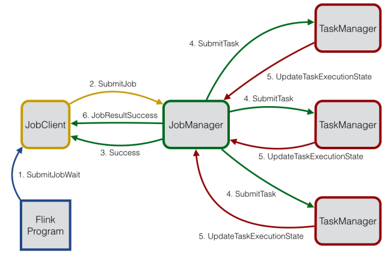

### 3.4. Apache Flink Programs and Dataflows
The basic building blocks of Flink programs are streams and transformations. 
Conceptually a stream is a (potentially never-ending) flow of data records, and a transformation is an operation that takes one or more streams as input, and produces one or more output streams as a result.
When executed, Flink programs are mapped to streaming dataflows, consisting of streams and transformation operators. Each dataflow starts with one or more sources and ends in one or more sinks. The dataflows resemble arbitrary directed acyclic graphs (DAGs). Although special forms of cycles are permitted via iteration constructs, for the most part we will gloss over this for simplicity.

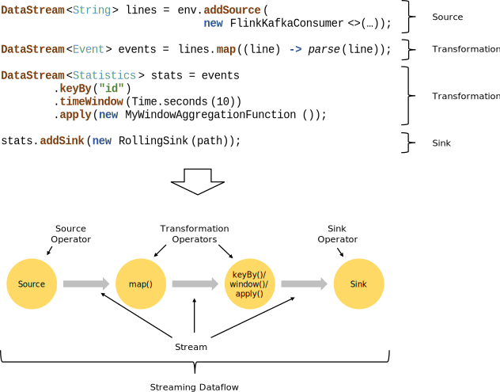  

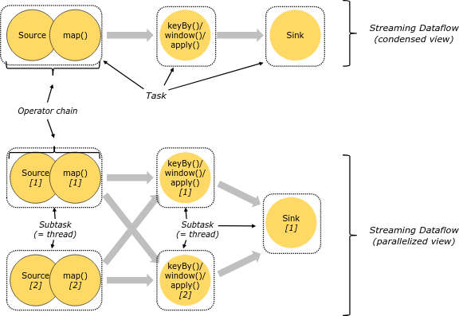 |

### 3.5. Data Source
* Sources are where the program reads its input from. 
* A source is attached to the program by using StreamExecutionEnvironment.addSource(sourceFunction). 
* Flink comes with a number of pre-implemented source functions, but you can always write your own custom sources by implementing the SourceFunction for non-parallel sources, or by implementing the ParallelSourceFunction interface or extending the RichParallelSourceFunction for parallel sources.

There are several predefined stream sources accessible from the StreamExecutionEnvironment:

**1. File-based:**
* readTextFile(path) - Reads text files, i.e. files that respect the TextInputFormat specification, line-by-line and returns them as Strings.
* readFile(fileInputFormat, path) - Reads (once) files as dictated by the specified file input format.
* readFile(fileInputFormat, path, watchType, interval, pathFilter, typeInfo) - This is the method called internally by the two previous ones. It reads files in the path based on the given fileInputFormat. Depending on the provided watchType, this source may periodically monitor (every interval ms) the path for new data (FileProcessingMode.PROCESS_CONTINUOUSLY), or process once the data currently in the path and exit (FileProcessingMode.PROCESS_ONCE). Using the pathFilter, the user can further exclude files from being processed.

**2. Socket-based:**
* socketTextStream - Reads from a socket. Elements can be separated by a delimiter.

**3. Collection-based:**
* fromCollection(Collection) - Creates a data stream from the Java Java.util.Collection. All elements in the collection must be of the same type.
* fromCollection(Iterator, Class) - Creates a data stream from an iterator. The class specifies the data type of the elements returned by the iterator.
* fromElements(T ...) - Creates a data stream from the given sequence of objects. All objects must be of the same type.
* fromParallelCollection(SplittableIterator, Class) - Creates a data stream from an iterator, in parallel. The class specifies the data type of the elements returned by the iterator.
* generateSequence(from, to) - Generates the sequence of numbers in the given interval, in parallel.

**4. Custom:**
* addSource - Attach a new source function. For example, to read from Apache Kafka you can use addSource(new FlinkKafkaConsumer08<>(...)). See connectors for more details.

### 3.6. Collection Data Sources
Flink provides special data sources which are backed by Java collections to ease testing. Once a program has been tested, the sources and sinks can be easily replaced by sources and sinks that read from / write to external systems.

```java
final StreamExecutionEnvironment env = StreamExecutionEnvironment.createLocalEnvironment();

// Create a DataStream from a list of elements
DataStream<Integer> myInts = env.fromElements(1, 2, 3, 4, 5);

// Create a DataStream from any Java collection
List<Tuple2<String, Integer>> data = ...
DataStream<Tuple2<String, Integer>> myTuples = env.fromCollection(data);

// Create a DataStream from an Iterator
Iterator<Long> longIt = ...
DataStream<Long> myLongs = env.fromCollection(longIt, Long.class);
```

**Note**: Currently, the collection data source requires that data types and iterators implement Serializable. Furthermore, collection data sources can not be executed in parallel ( parallelism = 1).

### 3.7. DataStream Transformations
See the following links:\
https://ci.apache.org/projects/flink/flink-docs-stable/dev/stream/operators/index.html

https://ci.apache.org/projects/flink/flink-docs-stable/dev/batch

https://ci.apache.org/projects/flink/flink-docs-stable/dev/batch/dataset_transformations.html

**DataStream Transformations Functions**
Most transformations require user-defined functions. This section lists different ways of how they can be specified.

**1. Implementing an interface**

The most basic way is to implement one of the provided interfaces:
```java
class MyMapFunction implements MapFunction<String, Integer> {
	public Integer map(String value) { 
		return Integer.parseInt(value); 
	}
};
data.map(new MyMapFunction());
```
**2. Anonymous classes**

You can pass a function as an anonymous class:
```java
data.map(new MapFunction<String, Integer> () {
	public Integer map(String value) { 
		return Integer.parseInt(value); 
	}
});
```
**3. Java 8 Lambdas**

Flink also supports Java 8 Lambdas in the Java API.
```java
data.filter(s -> s.startsWith("http://"));
data.reduce((i1, i2) -> i1 + i2);
```

### 3.8. Data Sink
Data sinks consume DataStreams and forward them to files, sockets, external systems, or print them. Flink comes with a variety of built-in output formats that are encapsulated behind operations on the DataStreams:
* writeAsText() / TextOutputFormat - Writes elements line-wise as Strings. The Strings are obtained by calling the toString() method of each element.
* writeAsCsv(...) / CsvOutputFormat - Writes tuples as comma-separated value files. Row and field delimiters are configurable. The value for each field comes from the toString() method of the objects.
* print() / printToErr() - Prints the toString() value of each element on the standard out / standard error stream. Optionally, a prefix (msg) can be provided which is prepended to the output. This can help to distinguish between different calls to print. If the parallelism is greater than 1, the output will also be prepended with the identifier of the task which produced the output.
* writeUsingOutputFormat() / FileOutputFormat - Method and base class for custom file outputs. Supports custom object-to-bytes conversion.
* writeToSocket - Writes elements to a socket according to a SerializationSchema
* addSink - Invokes a custom sink function. Flink comes bundled with connectors to other systems (such as Apache Kafka) that are implemented as sink functions.

### 3.9. Iterations
Iterative streaming programs implement a step function and embed it into an IterativeStream. As a DataStream program may never finish, there is no maximum number of iterations. Instead, you need to specify which part of the stream is fed back to the iteration and which part is forwarded downstream using a split transformation or a filter. Here, we show an example using filters. First, we define an IterativeStream
```java
IterativeStream<Integer> iteration = input.iterate();
```
Then, we specify the logic that will be executed inside the loop using a series of transformations (here a simple map transformation)
```java
DataStream<Integer> iterationBody = iteration.map(/* this is executed many times */);
```
To close an iteration and define the iteration tail, call the closeWith(feedbackStream) method of the IterativeStream. The DataStream given to the closeWith function will be fed back to the iteration head. A common pattern is to use a filter to separate the part of the stream that is fed back, and the part of the stream which is propagated forward. These filters can, e.g., define the “termination” logic, where an element is allowed to propagate downstream rather than being fed back.
```java
iteration.closeWith(iterationBody.filter(/* one part of the stream */));
DataStream<Integer> output = iterationBody.filter(/* some other part of the stream */);
```

**See more**: https://ci.apache.org/projects/flink/flink-docs-stable/dev/datastream_api.html

### 3.10. Apache Flink Build/Run/Test

**1. Build Flink from source code**
```
$ git clone https://github.com/apache/flink.git
$ cd flink
$ git checkout release-1.8.1
$ mvn clean install -Pinclude-kinesis -DskipTests
```

**2. Start Flink Cluster**

https://ci.apache.org/projects/flink/flink-docs-release-1.8/ops/deployment/cluster_setup.html

```
$ cd [flink]/build-target

# Change the flink master ip by editting the jobmanager.rpc.address value
$ nano conf/flink-conf.yaml

# Configure flink slave (worker) nodes
$ nano conf/slaves

# Start the cluster
$ bin/start-cluster.sh
# Then type passwords of slave nodes for the master to execute them...
```

**[NOTE]:** The Flink directory must be available on every worker under the same path. You can use a shared NFS directory, or copy the entire Flink directory to every worker node.

Check the cluster dashboard by access to http://<flink-master-ip>:8081

**Test a Flink Job**

Firstly run a input stream server using Netcat
```
# -l: listen (server mode)
$ nc -l 9000
```

To test client using Netcat
```
$ nc localhost 9000
```

**If you want to test streaming huge data you can run the python tcp server in the scripts folder**
```bash
$ python [stream-processing]/src/scripts/tcp_server.py
```

Then you can type sentences from the terminal to send data to Flink job application. There are 2 ways to test a Flink job:

- Submit new job from the dashboard
```
See the example below (Index 2.3)
```

- Manually running job from terminal
```
$ ./bin/flink run [flink-word-count-path]/SocketWindowWordCount.jar --hostname <netcat-host-ip> --port 9000
```

**3. Flink Cluster**


**4. Flink Cluster Dashboards**
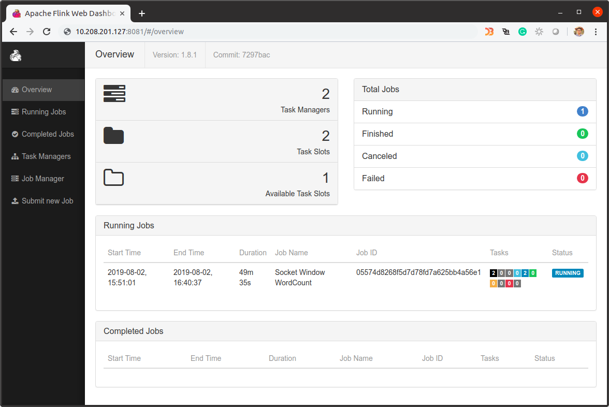

**5. Task Managers**
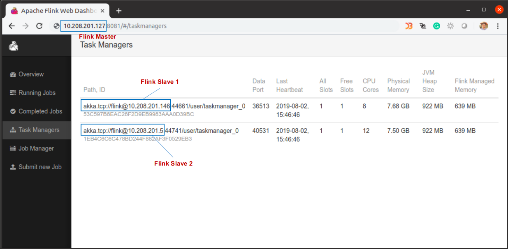

**6. Job Submission**


**7. Job Results**
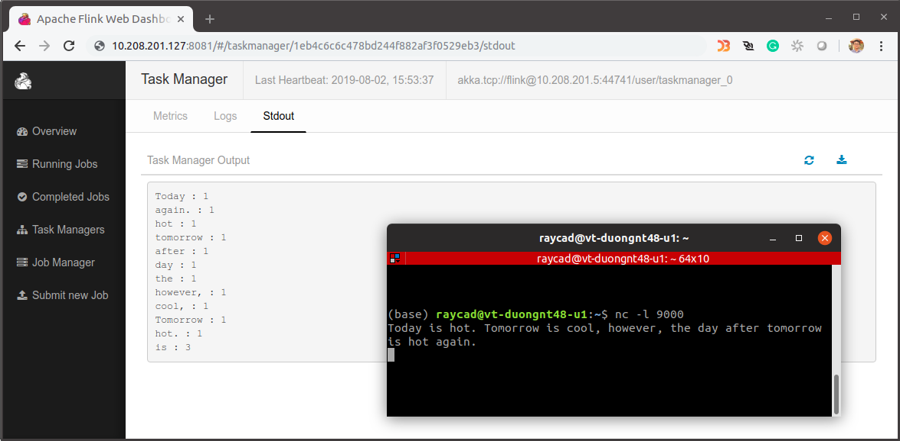

**8. Stop Flink Cluster**
```
$ ./bin/stop-cluster.sh
```

## 4. Apache Spark
### 4.1. Apache Spark Features
**Apache Spark** is an open source cluster computing framework for real-time data processing. The main feature of Apache Spark is its in-memory cluster computing that increases the processing speed of an application. Spark provides an interface for programming entire clusters with implicit data parallelism and fault tolerance. It is designed to cover a wide range of workloads such as batch applications, iterative algorithms, interactive queries, and streaming.

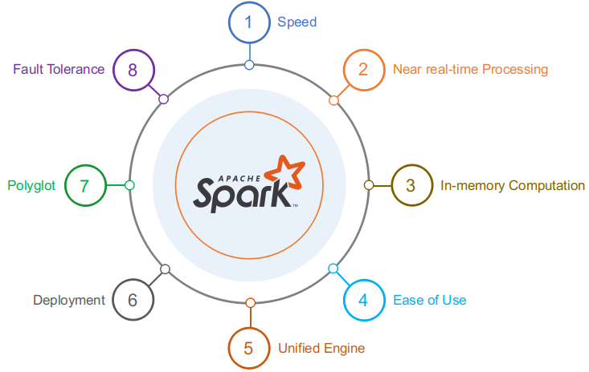

**1. Speed**

Spark runs up to 100 times faster than Hadoop MapReduce for large-scale data processing. It is also able to achieve this speed through controlled partitioning. Source

**2. Near real-time Processing**

It offers near real-time computation & low latency because of in-memory computation.

**3. In-memory Computation**

Data is kept in random access memory(RAM) instead of some slow disk drives and is processed in parallel. It improves the performance by an order of magnitudes by keeping the data in memory.

**4. Ease of Use**

Spark has easy-to-use APIs for operating on large datasets. This includes a collection of over 100 operators for transforming data and familiar data frame APIs for manipulating semi-structured data.

**5. Unified Engine**

Spark comes packaged with higher-level libraries, including support for SQL queries, streaming data, machine learning and graph processing. These standard libraries increase developer productivity and can be seamlessly combined to create complex workflows.

**6. Deployment**

It can be deployed through Mesos, Hadoop via YARN, or Spark’s own cluster manager.

**7. Polyglot**

Spark provides high-level APIs in Java, Scala, Python, and R. Spark code can be written in any of these four languages. It also provides a shell in Scala and Python.

**8. Fault Tolerance**

Upon the failure of worker node, using lineage of operations we can re-compute the lost partition of RDD from the original one. Thus, we can easily recover the lost data.

### 4.2. Apache Spark Ecosystem
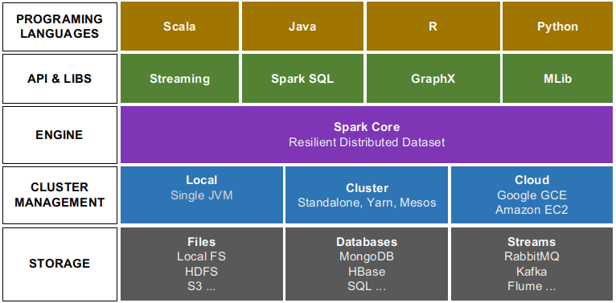

**1. Spark Core**
Spark Core is the base engine for large-scale parallel and distributed data processing. It is responsible for memory management and fault recovery, scheduling, distributing and monitoring jobs on a cluster & interacting with storage systems.

**2. Spark Streaming**
Spark Streaming is the component of Spark which is used to process real-time streaming data. Thus, it is a useful addition to the core Spark API. It enables high-throughput and fault-tolerant stream processing of live data streams.

**3. Spark SQL**
Spark SQL is a new module in Spark which integrates relational processing with Spark’s functional programming API. It supports querying data either via SQL or via the Hive Query Language. For those of you familiar with RDBMS, Spark SQL will be an easy transition from your earlier tools where you can extend the boundaries of traditional relational data processing.

**4. GraphX**
GraphX is the Spark API for graphs and graph-parallel computation. Thus, it extends the Spark RDD with a Resilient Distributed Property Graph. At a high-level, GraphX extends the Spark RDD abstraction by introducing the Resilient Distributed Property Graph (a directed multigraph with properties attached to each vertex and edge).

**5. MLlib (Machine Learning)**
MLlib stands for Machine Learning Library. Spark MLlib is used to perform machine learning in Apache Spark.

### 4.3. Apache Spark Architecture

| Term | Meaning |
|-|-|
| Application | User program built on Spark. Consists of a driver program and executors on the cluster.|
| Application jar | A jar containing the user's Spark application. In some cases users will want to create an "uber jar" containing their application along with its dependencies. The user's jar should never include Hadoop or Spark libraries, however, these will be added at runtime.|
| Driver program | The process running the main() function of the application and creating the SparkContext.|
| Cluster manager | An external service for acquiring resources on the cluster (e.g. standalone manager, Mesos, YARN).|
| Deploy mode | Distinguishes where the driver process runs. In "cluster" mode, the framework launches the driver inside of the cluster. In "client" mode, the submitter launches the driver outside of the cluster.|
| Worker node | Any node that can run application code in the cluster.|
| Executor | A process launched for an application on a worker node, that runs tasks and keeps data in memory or disk storage across them. Each application has its own executors.|
| Task | A unit of work that will be sent to one executor.|
| Job | A parallel computation consisting of multiple tasks that gets spawned in response to a Spark action (e.g. save, collect); you'll see this term used in the driver's logs.|
| Stage | Each job gets divided into smaller sets of tasks called stages that depend on each other (similar to the map and reduce stages in MapReduce); you'll see this term used in the driver's logs.|

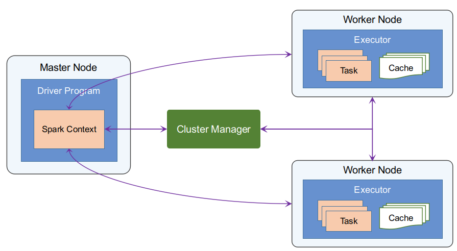

**1. Spark Driver**
* Separate process to execute user applications
* Creates SparkContext to schedule jobs execution and negotiate with cluster manager

**2. Executors**
* Run tasks scheduled by driver
* Store computation results in memory, on disk or off-heap
* Interact with storage systems

**3. Cluster Manager**
* Mesos
* YARN
* Spark Standalone

**4. SparkContext**
* Represents the connection to a Spark cluster, and can be used to create RDDs, accumulators and broadcast variables on that cluster

**5. DAGScheduler**
* Computes a DAG of stages for each job and submits them to TaskScheduler
* Determines preferred locations for tasks (based on cache status or shuffle files locations) and finds minimum schedule to run the jobs

**6. TaskScheduler**
* Responsible for sending tasks to the cluster, running them, retrying if there are failures, and mitigating stragglers

**7. SchedulerBackend**
* Backend interface for scheduling systems that allows plugging in different implementations(Mesos, YARN, Standalone, local)

**8. BlockManager**
* Provides interfaces for putting and retrieving blocks both locally and remotely into various stores (memory, disk, and off-heap)


### 4.4. Resilient Distributed Dataset (RDD)
RDDs are the building blocks of any Spark application. RDDs Stands for:
* Resilient: Fault tolerant and is capable of rebuilding data on failure
* Distributed: Distributed data among the multiple nodes in a cluster
* Dataset: Collection of partitioned data with values, e.g. tuples or other objects


**1. In-memory Computation**
* RDDs stores intermediate data/results in RAM instead of disk.

**2. Lazy Evaluations**
* All transformations are lazy, right away it will not compute the results. 
* Apache Spark computes transformations when an action requires a result for the driver program.

**3. Immutability**
* Once RDD created it cannot be changed because of read only abstraction.
* RDD can be transformed one form to another RDD using transformations like map, filter, join and co-group.
* Immutable nature of RDD Spark helps to maintain level of high consistency.

**4. Partitioned**
* Partitions are basic units of parallelism in Apache Spark
* RDDs are collection of partitions.
* Each partition is one logical division of data which is mutable in nature. One can create a partition through some transformations on existing partitions.
* Partitions of an RDD are distributed across all the nodes in a network.

**5. Parallel**

**6. Persistence**
* In RDD persistence nature does fast computations.
* Here users have the option of selecting RDD for reuse and they can also select storage either disk or in-memory to store data.

**7. Fault Tolerance**
* Spark RRD has the capability to operate and recover loss after a failure occurs.
* It rebuild lost data on failure using lineage, each RDD remembers how it was created from other datasets to recreate itself.

### 4.5. RDD Workflow


There are two ways to create RDDs − parallelizing an existing collection in your driver program, or by referencing a dataset in an external storage system, such as a shared file system, HDFS, HBase, etc.

### 4.6. RDD Operations
RDDs support two types of operations: 
* Transformations: are the functions that take an RDD as an input and produce one or more RDDs as an output.
* Actions: which returns final result to the driver program after running RDD computations on the dataset. 

**E.g:**
* map is a transformation that passes each dataset element through a function and returns a new RDD representing the results. 
* reduce is an action that aggregates all the elements of the RDD using some function and returns the final result to the driver program (although there is also a parallel reduceByKey that returns a distributed dataset).

**1. Transformations**
* Apply user function to every element in a partition (or to the whole partition).
* Apply aggregation function to the whole dataset (groupBy, sortBy).
* Introduce dependencies between RDDs to form DAG.
* Provide functionality for repartitioning (repartition, partitionBy).

**2. Actions**
* Trigger job execution.
* Used to materialize computation results.

### 4.7. Directed Acyclic Graph (DAG)
**Direct**: Means which is directly connected from one node to another. This creates a sequence i.e. each node is in linkage from earlier to later in the appropriate sequence.

**Acyclic**: Defines that there is no cycle or loop available. Once a transformation takes place it cannot returns to its earlier position.

**Graph**: From graph theory, it is a combination of vertices and edges. Those pattern of connections together in a sequence is the graph.

**Directed Acyclic Graph** is an arrangement of edges and vertices. In this graph, vertices indicate RDDs and edges refer to the operations applied on the RDD. According to its name, it flows in one direction from earlier to later in the sequence. When we call an action, the created DAG is submitted to DAG Scheduler. That further divides the graph into the stages of the jobs.

* The DAG scheduler divides operators into stages of tasks. A stage is comprised of tasks based on partitions of the input data. The DAG scheduler pipelines operators together. For e.g. Many map operators can be scheduled in a single stage. The final result of a DAG scheduler is a set of stages.
* The Stages are passed on to the Task Scheduler.The task scheduler launches tasks via cluster manager (Spark Standalone/Yarn/Mesos). The task scheduler doesn't know about dependencies of the stages.
* The Worker executes the tasks on the Slave.

### 4.8. Internal Job Execution In Spark


**STEP 1**: The client submits spark user application code. When an application code is submitted, the driver implicitly converts user code that contains transformations and actions into a logically directed acyclic graph called DAG. At this stage, it also performs optimizations such as pipelining transformations.

**STEP 2**: After that, it converts the logical graph called DAG into physical execution plan with many stages. After converting into a physical execution plan, it creates physical execution units called tasks under each stage. Then the tasks are bundled and sent to the cluster.

**STEP 3**: Now the driver talks to the cluster manager and negotiates the resources. Cluster manager launches executors in worker nodes on behalf of the driver. At this point, the driver will send the tasks to the executors based on data placement. When executors start, they register themselves with drivers. So, the driver will have a complete view of executors that are executing the task.

**STEP 4**: During the course of execution of tasks, driver program will monitor the set of executors that runs. Driver node also schedules future tasks based on data placement. 

**Example**
```java
val input = sc.textFile("log.txt")
val splitedLines = input.map(line => line.split(" "))
                                    .map(words => (words(0), 1))
                                    .reduceByKey{(a,b) => a + b}

```

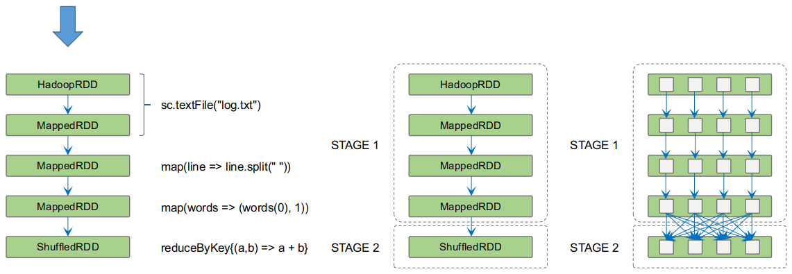

## 5. Data Processing Technologies Comparison

| | Apache Hadoop | Apache Spark | Apache Flink |
|-|-|-|-|
| Year of Origin| 2005| 2009| 2009|
| Place of Origin| MapReduce (Google) Hadoop (Yahoo)| University of California, Berkeley| Technical University of Berlin|
| Data Processing Engine| Batch| Micro-Batch| Stream|
| Processing Speed| Slower than Spark and Flink| 100x Faster than Hadoop| Faster than spark|
| Data Transfer| Batch| Micro-Batch| Pipelined and Batch|
| Programming Languages| Java, C, C++, Ruby, Groovy, Perl, Python| Java, Scala, Python and R| Java and Scala|
| Programming Model| MapReduce| Resilient Distributed Datasets (RDD)| Cyclic Dataflows|
| Memory Management| Disk Based| JVM Managed| Active Managed|
| Latency| Low| Medium| Low|
| Throughput| Medium| High| High|
| Optimization| Manual| Manual| Automatic|
| API| Low-level| High-level| High-level|
| Streaming Support| NA| Spark Streaming| Flink Streaming|
| SQL Support| Hive, Impala| SparkSQL| Table API and SQL|
| Graph Support| NA| GraphX| Gelly|
| Machine Learning Support| NA| SparkML| FlinkML|

## 6. References

https://ci.apache.org/projects/flink/flink-docs-stable/dev/stream/operators/index.html

https://ci.apache.org/projects/flink/flink-docs-stable/dev/batch

https://ci.apache.org/projects/flink/flink-docs-stable/dev/batch/dataset_transformations.html

https://cwiki.apache.org/confluence/display/FLINK/Data+exchange+between+tasks

https://www.infoq.com/articles/machine-learning-techniques-predictive-maintenance

https://www.edureka.co/blog/spark-architecture

https://data-flair.training/blogs/spark-tutorial

https://data-flair.training/blogs/spark-in-memory-computing

https://medium.com/stream-processing/what-is-stream-processing-1eadfca11b97